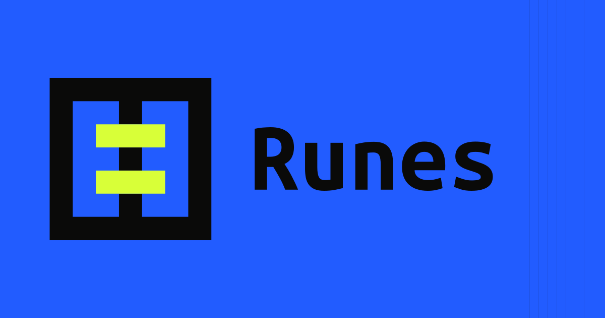

# Runes



Runes is an open-source personal identity system for software projects. A single 7×7 orthogonal character becomes a complete, deterministic asset family for social profiles, desktop apps, menu bars, Windows, the web, and presentations.

The repository currently contains one system identity and 41 project identities. Every Rune has its own source geometry, accent role, tagline, project link, and design rationale.

## What it generates

Each identity produces:

- Canonical mono, inverse, duotone, horizontal, stacked, and field-backed SVG logos
- 1024 social avatar, 1200×630 Open Graph image, and 1500×500 X header
- Apple 1024 app source, Dock PNG, menu bar template assets, iconset, and ICNS on macOS
- Windows ICO containing 16, 24, 32, 48, and 256 pixel images
- Web SVG, transparent mark, favicon PNGs, Apple touch icon, and PWA icons
- 1920×1080 presentation title slide
- Per-identity manifest and repository-wide SHA-256 checksums

The public catalog keeps the lightweight SVG set in Git. Full platform packs are generated locally or downloaded from the CI artifact.

## Run locally

```bash
pnpm install
pnpm assets:build
pnpm dev
```

Open `http://localhost:3000`.

Run the complete gate:

```bash
pnpm check
```

## Repository map

```text
brand/runes.json      Identity geometry, metadata, color role, and rationale
brand/tokens.json     Canonical color, geometry, and typography tokens
brand/theme.css       Reusable website theme contract
scripts/generate.mjs  Deterministic SVG and platform-asset generator
scripts/check.mjs     Geometry, export, raster, and checksum verification
public/generated/     Reviewable SVG catalog used by the website
artifacts/            Reproducible full export packs, intentionally ignored
docs/                 Brand and platform rules
```

## Add a Rune

Add one object to `brand/runes.json` with a unique slug, a seven-row binary grid, a design rationale, an accent role, and signal cells that land on filled grid positions. Then run `pnpm check`.

The generator rejects malformed grids, duplicate characters, unknown accent roles, out-of-shape signal cells, missing exports, font-dependent SVG text, incorrect raster dimensions, and checksum drift.

The catalog includes public, non-fork repositories with independent product or tool semantics. Profile repositories, package distribution taps, learning samples, and explicitly legacy integrations stay outside the identity count.

Read [Brand system](docs/BRAND.md), [Platform contracts](docs/PLATFORMS.md), and [Contributing](CONTRIBUTING.md) before proposing a new identity or output format.

## License

[MIT](LICENSE)
